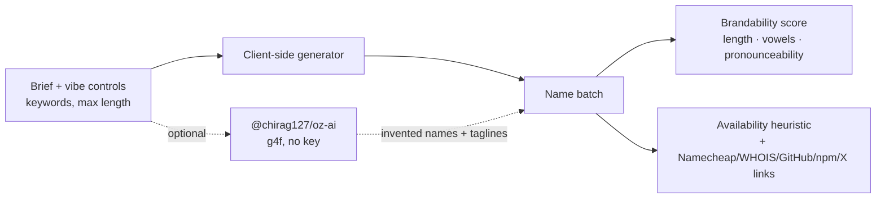

# oriz-name

> Neon-marquee name generator for brands, products, startups, usernames and repos — 100% client-side.

[](./LICENSE)
[](https://github.com/chirag127/oriz-name/stargazers)
[](https://github.com/chirag127/oriz-name/commits/main)
[](https://astro.build)
[](https://name.oriz.in)

Neon-marquee **name generator** for brands, products, startups, usernames and repo names — with vibe controls and client-side .com-style availability heuristics.

- **Live app:** https://name.oriz.in _(canonical — Cloudflare Pages)_
- **About / info:** https://chirag127.github.io/oriz-name/ _(GitHub Pages landing)_
- **Repo:** https://github.com/chirag127/oriz-name

**100% client-side — no upload, no signup, no server.** Every name is generated in your browser; nothing you type leaves the tab. The optional AI names/taglines call a keyless multi-provider model directly from the client.

**⭐ If this is useful, please [star the repo](https://github.com/chirag127/oriz-name/stargazers) — it helps others find it.**

## How it works



## What it does

- **Generate names** for a brand, product, startup, username, or repo.
- **Vibe controls** — techy, playful, luxe, minimal, retro, organic, edgy, friendly — plus optional keywords and a max-length slider.
- **Slot-machine reveal** — the marquee lights up with a fresh batch each spin.
- **Brandability score** per name (length, vowel balance, pronounceability, spelling).
- **Availability heuristic** — a client-side estimate of how likely `.com`/handle is free, with reasons, plus check-out links to Namecheap, WHOIS, GitHub, npm and X. *No live WHOIS — verify before you buy.*
- **AI names + taglines** (optional) — on-brief invented names, each with a tagline and a one-line rationale. Loaded on demand with provider failover; the core generator works even if AI is down.
- **Kind-aware handles** — `@username`, `kebab-repo-names`, `brand.com`.

## Stack

Static [Astro](https://astro.build) + React 19 islands + Tailwind v4. Shared atomic packages: `@chirag127/oz-ai` (AI), `@chirag127/oz-chrome` (header/footer shell), `@chirag127/oz-tokens-base` (token contract), `@chirag127/oz-file`. Bespoke neon-marquee theme layered on the shared `--oz-*` contract.

## Develop

```bash
npm install --legacy-peer-deps
npm run dev            # local dev
npm test               # vitest — pure generator + availability logic
npm run build          # static build → dist/
npm run deploy         # build + wrangler pages deploy (project: oriz-name)
```

Windows: use **npm** (pnpm skips `@esbuild/win32-x64`).

## Privacy

No accounts, no analytics of your input, no server. Name generation and availability heuristics run entirely in the browser. Availability is heuristic — always verify with the linked registrars before purchasing a domain or claiming a handle.

## Part of the oriz family

One of ~80 small, fast, single-purpose tools and sites in the **oriz** fleet — see [blog.oriz.in](https://blog.oriz.in) for how it's built and run solo. Sibling tools: [json.oriz.in](https://json.oriz.in) · [case.oriz.in](https://case.oriz.in) · [resume.oriz.in](https://resume.oriz.in) · [diagram.oriz.in](https://diagram.oriz.in) · [muse.oriz.in](https://muse.oriz.in).

**Cost:** $0 — static build hosted free on Cloudflare Pages; AI is keyless (g4f) and client-side.

## Contributing

Issues and PRs welcome. Conventional commits are the changelog.

## Author

Chirag Singhal · chirag@oriz.in

## Status

Stable.

## License

MIT © 2026 Chirag Singhal
